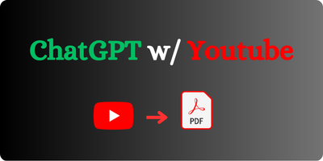

# Chat with Youtube Video Using OpenAI and Langcahin

## This app allows you to paste url of any youtube video and QnA from within that video using openai API key

There are two python files

1- frontend.py (front end in streamlit)

2- backend.py (main functioning code)

If you have any questions, feel free to reach out at:
https://twitter.com/ZuburuDubuda